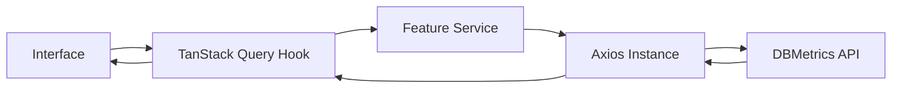
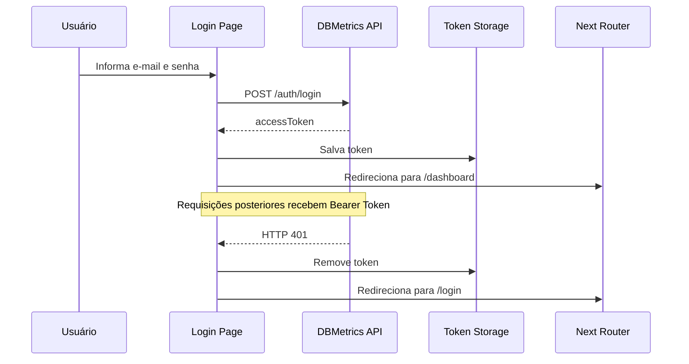
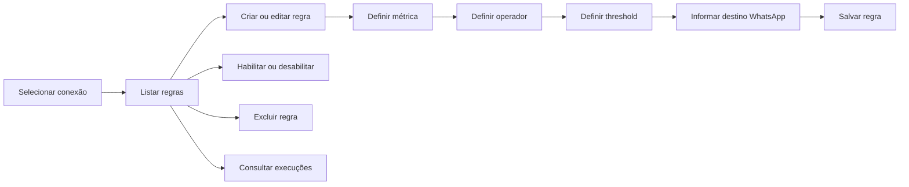

# DBMetrics Web

Interface web do **DBMetrics**, uma plataforma de monitoramento de bancos de dados MySQL e PostgreSQL.

O frontend oferece uma visão centralizada das conexões monitoradas, métricas operacionais, histórico de coletas e regras de alerta, integrando-se à API do DBMetrics para transformar dados técnicos em informações acessíveis e acionáveis.

Desenvolvido com **Next.js, React, TypeScript, TanStack Query, React Hook Form, Zod, Tailwind CSS e shadcn/ui**.

---

## Visão geral

O DBMetrics Web é responsável pela experiência de uso da plataforma.

A aplicação permite:

- autenticar usuários;
- acompanhar um resumo geral do ambiente monitorado;
- cadastrar e gerenciar conexões MySQL e PostgreSQL;
- consultar detalhes técnicos de cada conexão;
- visualizar métricas consolidadas;
- analisar séries temporais em gráficos;
- navegar pelo histórico de snapshots;
- criar, editar, habilitar e excluir regras de alerta;
- acompanhar o histórico de execuções e notificações.

O frontend foi estruturado por features, mantendo componentes, hooks, serviços, schemas e tipos próximos ao contexto funcional ao qual pertencem.

---

## Principais funcionalidades

### Autenticação

- Login com e-mail e senha.
- Armazenamento do access token no navegador.
- Inclusão automática do Bearer Token nas requisições.
- Proteção das rotas privadas com `AuthGuard`.
- Redirecionamento de usuários não autenticados para `/login`.
- Redirecionamento de usuários autenticados para `/dashboard`.
- Logout com remoção da sessão local.
- Tratamento global de respostas HTTP `401`.
- Encerramento automático da sessão quando o token deixa de ser aceito pela API.

O backend utiliza apenas access token. Não há fluxo de refresh token no frontend.

---

### Dashboard

A página inicial da área autenticada apresenta uma visão consolidada do ambiente monitorado.

Indicadores exibidos:

- total de conexões;
- tamanho total dos bancos;
- total de conexões ativas;
- total de tabelas.

A página também apresenta uma lista das conexões monitoradas com:

- nome;
- provider;
- banco;
- versão;
- tamanho;
- conexões ativas;
- data da última coleta;
- status de saúde.

Status representados:

```text
ONLINE
WARNING
CRITICAL
NO DATA
```

Cada conexão possui acesso direto à página de detalhes e métricas.

---

### Gerenciamento de conexões

O módulo de conexões permite:

- listar conexões cadastradas;
- criar uma nova conexão;
- editar uma conexão;
- excluir uma conexão;
- testar a conectividade;
- acessar os detalhes;
- monitorar MySQL e PostgreSQL.

Dados utilizados no cadastro:

- nome;
- provider;
- host;
- porta;
- banco;
- usuário;
- senha.

Os formulários utilizam:

- React Hook Form;
- Zod;
- validação de entrada;
- mensagens de erro;
- estados de envio;
- feedback visual por toast.

A listagem também possui estados específicos para:

- carregamento;
- erro;
- ausência de conexões.

---

### Detalhes da conexão

Cada conexão possui uma página própria:

```text
/database-connections/:connectionId
```

A página apresenta:

- nome;
- provider;
- host;
- porta;
- banco;
- usuário;
- resumo das métricas;
- gráfico histórico;
- tabela de snapshots.

Também existem tratamentos específicos para:

- carregamento;
- conexão inexistente;
- falha de comunicação;
- ausência de dados.

---

### Resumo de métricas

A seção de resumo apresenta o último estado conhecido da conexão.

As informações podem incluir:

- versão do banco;
- tamanho do banco;
- conexões ativas;
- tabelas;
- views;
- schemas;
- índices;
- funções;
- horário da última coleta;
- variações em relação ao período anterior.

---

### Gráficos

O projeto utiliza **Recharts** para representar a evolução das métricas.

A página de conexão consome séries temporais fornecidas pelo backend e permite analisar o comportamento do banco ao longo do tempo.

O módulo possui estrutura própria para:

- transformação de datas;
- formatação dos valores;
- carregamento;
- erro;
- ausência de dados.

---

### Histórico de métricas

O histórico apresenta os snapshots armazenados pelo backend.

A integração oferece suporte a:

- consulta por conexão;
- paginação;
- período inicial;
- período final;
- navegação entre páginas;
- exibição da data da coleta;
- visualização dos valores registrados.

O histórico é obtido pelo endpoint de dashboard do backend, separado da consulta em tempo real.

---

### Regras de alerta

A área de alertas permite selecionar uma conexão e gerenciar suas regras de monitoramento.

Funcionalidades disponíveis:

- listar regras;
- criar regra;
- editar regra;
- habilitar regra;
- desabilitar regra;
- excluir regra;
- consultar execuções;
- navegar pelo histórico paginado.

Métricas disponíveis para alertas:

```text
DATABASE_SIZE
ACTIVE_CONNECTIONS
TABLES_COUNT
VIEWS_COUNT
SCHEMAS_COUNT
INDEXES_COUNT
FUNCTIONS_COUNT
```

Operadores disponíveis:

```text
GREATER_THAN
GREATER_THAN_OR_EQUAL
LESS_THAN
LESS_THAN_OR_EQUAL
EQUAL
NOT_EQUAL
```

O canal atualmente suportado pela interface é:

```text
WHATSAPP
```

Cada regra contém:

- conexão;
- métrica;
- operador;
- threshold;
- número de destino;
- status habilitado ou desabilitado.

---

### Histórico de execuções

O frontend exibe o histórico de processamento dos alertas.

Informações representadas:

- conexão;
- provider;
- banco;
- host;
- porta;
- métrica;
- operador;
- valor coletado;
- threshold;
- destino;
- status;
- horário de disparo;
- horário de envio;
- mensagem de erro, quando existente.

Status possíveis:

```text
PENDING
SENT
FAILED
```

A listagem possui paginação independente para cada conexão selecionada.

---

## Arquitetura do frontend

O projeto utiliza o **Next.js App Router** e combina organização por rota com modularização por feature.

```text
src/
├── app/
├── components/
├── features/
├── lib/
├── providers/
└── utils/
```

---

## Estrutura de rotas

```text
src/app/
├── (public)/
│   └── login/
│       └── page.tsx
│
├── (private)/
│   ├── dashboard/
│   │   └── page.tsx
│   ├── database-connections/
│   │   ├── page.tsx
│   │   └── details/
│   │       └── page.tsx
│   ├── alerts/
│   │   └── page.tsx
│   ├── workspace/
│   │   └── page.tsx
│   ├── settings/
│   │   └── page.tsx
│   └── layout.tsx
│
├── layout.tsx
└── page.tsx
```

As rotas `workspace` e `settings` possuem apenas a estrutura inicial e ainda não entregam uma interface funcional.

---

## Organização por features

```text
src/features/
├── auth/
├── dashboard/
├── database-connections/
├── metrics/
├── alerts/
└── workspace/
```

Cada feature pode conter:

```text
feature/
├── components/
├── constants/
├── hooks/
├── schemas/
├── services/
├── types/
├── utils/
└── index.ts
```

Essa estrutura mantém cada domínio funcional isolado e reduz o acoplamento entre partes não relacionadas da interface.

---

## Responsabilidade das camadas

### Components

Responsáveis pela interface e composição visual:

- formulários;
- tabelas;
- cards;
- diálogos;
- estados de carregamento;
- estados de erro;
- estados vazios;
- seções das páginas.

### Hooks

Encapsulam operações assíncronas e estados relacionados ao servidor.

Exemplos:

```text
useDashboardOverview
useDatabaseConnections
useDatabaseConnection
useCreateDatabaseConnection
useUpdateDatabaseConnection
useDeleteDatabaseConnection
useTestDatabaseConnection
useConnectionMetricsSummary
useConnectionMetricsChart
useConnectionMetricsHistory
useAlertRules
useAlertExecutions
useCreateAlertRule
useUpdateAlertRule
useEnableAlertRule
useDisableAlertRule
useDeleteAlertRule
```

### Services

Centralizam a comunicação HTTP com o backend.

Cada feature possui seu próprio serviço, evitando chamadas diretas à API espalhadas pelos componentes.

### Schemas

Definem validações dos formulários com Zod.

### Types

Representam contratos utilizados pela interface e pelas respostas da API.

### Constants

Centralizam opções de interface, query keys, métricas e operadores.

---

## Gerenciamento de estado do servidor

O projeto utiliza **TanStack Query** para gerenciar dados remotos.

A biblioteca é responsável por:

- execução de queries;
- mutations;
- cache;
- estados de carregamento;
- estados de erro;
- invalidação de queries;
- atualização da interface após operações;
- controle de requisições por feature.

O `QueryClient` é disponibilizado globalmente por meio de um provider da aplicação.

---

## Comunicação com a API

A aplicação utiliza uma instância centralizada do Axios:

```text
src/lib/api.ts
```

Responsabilidades:

- utilizar a URL base configurada;
- recuperar o token da sessão;
- adicionar o header `Authorization`;
- tratar respostas `401`;
- remover tokens inválidos;
- redirecionar para o login;
- evitar conflito com erros do próprio endpoint de autenticação.

Fluxo simplificado:



---

## Fluxo de autenticação



---

## Fluxo das métricas

```mermaid
flowchart TD
    PAGE[Página da conexão]

    PAGE --> SUMMARY[Resumo]
    PAGE --> CHART[Gráfico]
    PAGE --> HISTORY[Histórico]

    SUMMARY --> API1[/metrics-summary]
    CHART --> API2[/metrics-chart]
    HISTORY --> API3[/metrics-history]

    API1 --> BACKEND[DBMetrics API]
    API2 --> BACKEND
    API3 --> BACKEND
```

---

## Fluxo de alertas



---

## Componentes compartilhados

A aplicação possui componentes reutilizáveis para:

- layout;
- cabeçalho;
- navegação;
- botões;
- cards;
- inputs;
- selects;
- tabelas;
- badges;
- diálogos;
- confirmação de ações;
- skeletons.

Estrutura principal:

```text
src/components/
├── layout/
├── page/
└── ui/
```

Os componentes de interface seguem a abordagem do **shadcn/ui**, com composição sobre Radix UI e estilização por Tailwind CSS.

---

## Layout autenticado

As rotas privadas compartilham um layout formado por:

- `AuthGuard`;
- `AppShell`;
- `Sidebar`;
- `Header`;
- área principal de conteúdo.

A navegação lateral contém:

- Dashboard;
- Database Connections;
- Alerts.

A rota ativa é destacada de acordo com o caminho atual.

---

## Estados da interface

As features não dependem apenas de mensagens genéricas. Existem componentes específicos para diferentes estados.

### Conexões

- loading;
- error;
- empty;
- data table.

### Métricas

- loading;
- error;
- summary;
- chart;
- history.

### Alertas

- carregamento das conexões;
- erro ao carregar conexões;
- ausência de conexões;
- carregamento das regras;
- erro nas regras;
- ausência de regras;
- carregamento das execuções;
- erro nas execuções;
- ausência de execuções.

Essa separação melhora a previsibilidade dos componentes e evita condicionais excessivas nas páginas.

---

## Formulários e validação

Os formulários utilizam:

- React Hook Form;
- Zod;
- `@hookform/resolvers`;
- componentes acessíveis;
- mensagens vinculadas aos campos;
- `aria-invalid`;
- `aria-describedby`;
- estados desabilitados durante mutations.

Formulários implementados:

- login;
- criação de conexão;
- atualização de conexão;
- criação de regra de alerta;
- atualização de regra de alerta.

---

## Feedback de operações

O projeto utiliza **Sonner** para apresentar feedbacks ao usuário.

Exemplos:

- login inválido;
- falha de conexão com o servidor;
- conexão criada;
- conexão atualizada;
- conexão excluída;
- conectividade validada;
- regra criada;
- regra atualizada;
- regra habilitada;
- regra desabilitada;
- regra excluída;
- falha em uma operação.

---

## Tecnologias

### Core

- Next.js 16
- React 19
- TypeScript 5

### Interface

- Tailwind CSS 4
- shadcn/ui
- Radix UI
- Lucide React
- Recharts
- Sonner

### Dados e formulários

- TanStack Query 5
- Axios
- React Hook Form
- Zod
- Hookform Resolvers

### Qualidade

- ESLint 9
- ESLint Config Next
- TypeScript
- React Compiler

---

## Integração com o backend

Principais endpoints consumidos:

### Autenticação

```text
POST /auth/login
```

### Dashboard

```text
GET /dashboard/overview
```

### Conexões

```text
GET    /database-connections
GET    /database-connections/:id
POST   /database-connections
PATCH  /database-connections/:id
DELETE /database-connections/:id
POST   /database-connections/:id/test
GET    /database-connections/:id/metrics
```

### Métricas

```text
GET /dashboard/connections/:connectionId/metrics-summary
GET /dashboard/connections/:connectionId/metrics-chart
GET /dashboard/connections/:connectionId/metrics-history
```

### Alertas

```text
GET    /alerts/connection/:connectionId
POST   /alerts
PATCH  /alerts/:id
PATCH  /alerts/:id/enable
PATCH  /alerts/:id/disable
DELETE /alerts/:id
GET    /alerts/connection/:connectionId/executions
```

---

## Requisitos

- Node.js 20 ou superior
- pnpm
- DBMetrics API em execução

---

## Instalação

Clone o repositório:

```bash
git clone <https://github.com/RodolfoBispo997/DBMetrics_Front>
cd dbmetrics-web
```

Instale as dependências:

```bash
pnpm install
```

---

## Variáveis de ambiente

Crie um arquivo `.env.local` na raiz do projeto:

```env
NEXT_PUBLIC_API_URL=http://localhost:3333
```

| Variável              | Descrição                    |
| --------------------- | ---------------------------- |
| `NEXT_PUBLIC_API_URL` | URL base da API do DBMetrics |

Como a variável utiliza o prefixo `NEXT_PUBLIC_`, seu valor fica disponível no bundle executado pelo navegador. Ela deve conter apenas a URL pública da API, nunca credenciais ou segredos.

---

## Execução

### Desenvolvimento

```bash
pnpm dev
```

Aplicação disponível em:

```text
http://localhost:3000
```

### Build

```bash
pnpm build
```

### Produção

```bash
pnpm start
```

### Lint

```bash
pnpm lint
```

---

## Scripts

| Script  | Comando      | Finalidade                           |
| ------- | ------------ | ------------------------------------ |
| `dev`   | `next dev`   | Inicia o ambiente de desenvolvimento |
| `build` | `next build` | Gera a build de produção             |
| `start` | `next start` | Executa a build produzida            |
| `lint`  | `eslint`     | Executa a análise estática           |

---

## Estrutura resumida

```text
dbmetrics-web/
├── public/
├── src/
│   ├── app/
│   │   ├── (public)/
│   │   └── (private)/
│   ├── components/
│   │   ├── layout/
│   │   ├── page/
│   │   └── ui/
│   ├── features/
│   │   ├── auth/
│   │   ├── dashboard/
│   │   ├── database-connections/
│   │   ├── metrics/
│   │   ├── alerts/
│   │   └── workspace/
│   ├── lib/
│   ├── providers/
│   └── utils/
├── components.json
├── eslint.config.mjs
├── next.config.ts
├── package.json
├── pnpm-lock.yaml
└── tsconfig.json
```

---

## Status do projeto

### Implementado

- [x] Login
- [x] Proteção de rotas privadas
- [x] Logout
- [x] Tratamento global de `401`
- [x] Layout autenticado
- [x] Sidebar com rota ativa
- [x] Dashboard consolidado
- [x] Status das conexões
- [x] Listagem de conexões
- [x] Criação de conexão
- [x] Edição de conexão
- [x] Exclusão de conexão
- [x] Teste de conectividade
- [x] Página de detalhes
- [x] Resumo de métricas
- [x] Gráfico de métricas
- [x] Histórico paginado
- [x] Criação de alertas
- [x] Edição de alertas
- [x] Habilitar e desabilitar alertas
- [x] Exclusão de alertas
- [x] Histórico de execuções
- [x] Paginação de execuções
- [x] Estados de loading, error e empty
- [x] Validação com Zod
- [x] Feedback com toast

### Em aberto

- [ ] Interface de workspace
- [ ] Interface de configurações
- [ ] Refresh token
- [ ] Testes automatizados
- [ ] Testes E2E
- [ ] Página global de erro
- [ ] Loader compartilhado para o `AuthGuard`
- [ ] Estratégia de internacionalização
- [ ] Canal de alerta além do WhatsApp

---

## Decisões técnicas

### Organização por feature

Componentes, hooks, serviços, schemas e tipos são agrupados pelo contexto funcional.

Essa decisão:

- facilita a localização do código;
- reduz dependências transversais;
- melhora a manutenção;
- permite evolução independente das features;
- evita grandes diretórios globais separados apenas pelo tipo técnico.

---

### Serviços HTTP por domínio

Cada feature possui uma camada de serviço responsável pela comunicação com a API.

Os componentes não conhecem diretamente detalhes como:

- URL dos endpoints;
- método HTTP;
- configuração do Axios;
- headers de autenticação.

---

### TanStack Query para estado remoto

Os dados vindos do backend não são tratados como estado local comum.

TanStack Query centraliza:

- cache;
- sincronização;
- loading;
- error;
- mutations;
- invalidação;
- atualização após alterações.

---

### React Hook Form e Zod

React Hook Form controla o estado e o ciclo dos formulários, enquanto Zod concentra as regras de validação.

Essa separação permite:

- contratos explícitos;
- validação previsível;
- melhor tipagem;
- mensagens de erro consistentes;
- menor quantidade de estado manual.

---

### Interceptor centralizado

A autenticação HTTP é tratada em um único ponto.

O interceptor:

1. recupera o token;
2. adiciona o Bearer Token;
3. identifica respostas `401`;
4. encerra a sessão;
5. redireciona para o login.

O endpoint de login é excluído do redirecionamento automático para que erros de credenciais possam ser tratados pela própria página.

---

### Componentes específicos para estados assíncronos

Loading, error e empty states possuem componentes próprios nas features mais complexas.

Isso evita misturar regras de apresentação, requisições e tratamento de falhas em um único componente.

---

### Separação entre visão geral e detalhes

O dashboard apresenta uma leitura consolidada.

A página individual da conexão concentra:

- informações técnicas;
- resumo;
- gráfico;
- histórico.

Essa divisão mantém a página principal objetiva e reserva análises mais detalhadas para o contexto específico de cada banco.

---

## Limitações atuais

- O frontend depende da API do DBMetrics para autenticação e dados.
- A sessão é baseada apenas em access token armazenado no navegador.
- Não existe refresh token.
- A validade do JWT é confirmada pelas respostas da API, não antecipadamente pelo cliente.
- `Workspace` e `Settings` ainda não possuem interface funcional.
- O canal de alerta disponível é o WhatsApp.
- Não existem testes automatizados no repositório.
- Parte dos textos da interface está em inglês e não há estratégia de internacionalização.
- O `AuthGuard` retorna conteúdo vazio durante a verificação inicial da sessão.
- A aplicação não possui uma estratégia global de tratamento de erros de renderização.

---

## Roadmap

- Implementar workspace e configurações.
- Adicionar refresh token.
- Criar loader compartilhado para transições de autenticação.
- Adicionar testes unitários de hooks, serviços e componentes.
- Adicionar testes E2E dos fluxos principais.
- Criar estratégia global de erros.
- Implementar internacionalização.
- Aprimorar acessibilidade e navegação por teclado.
- Adicionar filtros avançados ao histórico.
- Expandir canais de alerta.
- Adicionar atualização periódica configurável das métricas.

---

## Projeto relacionado

Este frontend consome a API do DBMetrics, responsável por:

- autenticação;
- conexões monitoradas;
- coleta de métricas;
- armazenamento histórico;
- processamento de alertas;
- integração com a Evolution API.

Repositório do backend:

```text
<https://github.com/RodolfoBispo997/DBMetrics>
```

---

## Autor

Desenvolvido por **Rodolfo Bispo** como projeto de portfólio para demonstrar experiência na construção de interfaces SaaS integradas a APIs, dashboards, monitoramento de dados e fluxos operacionais.
